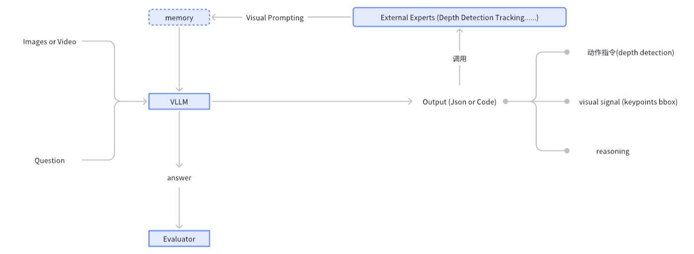

# Introduction

This repo aims to integrate **agentic skills** into spatial intelligence.

这个项目的主要目的是将智能体技术和空间智能结合。

- api_example ：我提供了一个我们做具身智能的api部署代码，在部署external expert也可以使用这个示例的方法，这样可以将不同expert包装成相似的api接口。


# Install
```
pip install -r requirements.txt
pip install "httpx[socks]"
```

# workflow



# TODO
## external expert
- [x] Depth anything v2
- [ ] SAM2

## workflow
- [ ] add workflow example
    - [ ] depth tool
    - [ ] detection tool
- [ ] add evaluation script
